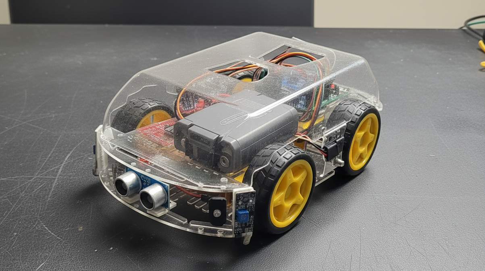
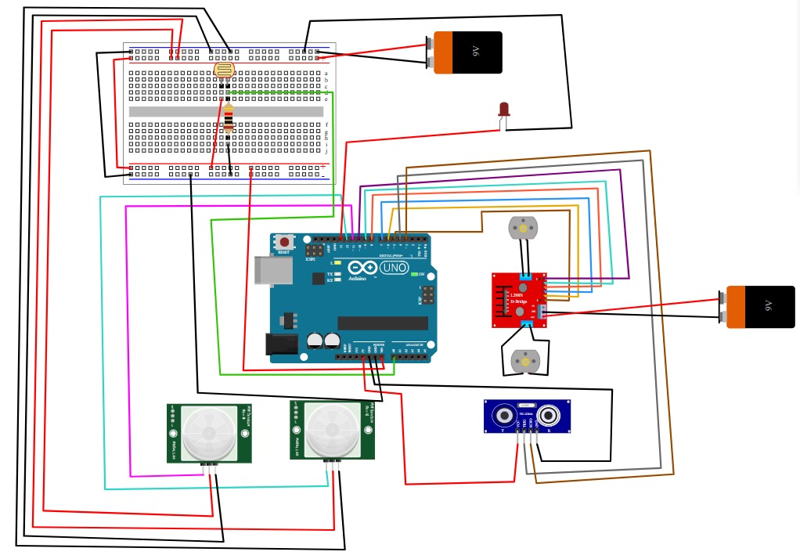

# Object Avoidance Robot (SelfCar)

This repository contains the Arduino sketch and supporting files for an Object Avoidance Robot ("SelfCar"). The main sketch is `car.ino`.

## Project overview

- Features:
	- Obstacle detection and avoidance using an ultrasonic sensor (HC-SR04)
	- Line following using two IR line sensors
	- Automatic headlight (LED) controlled by an LDR when the environment is dark
- Files of interest:
	- `car.ino` — Arduino sketch (motor control, sensors, behavior)
	- `Object_Avoidance_Robot.png` — project photo
	- `circuit_diagram.jpg` — circuit diagram / wiring image

See `USAGE.md` for wiring details, pin mapping, and behavior tuning.

## Hardware (typical)

- Arduino Uno (or compatible)
- Motor driver (L298N or similar)
- 2× DC motors with wheels
- Ultrasonic sensor (HC-SR04)
- 2× IR line sensors
- LDR (photoresistor) for ambient light detection
- LED for headlight (or an LED strip / transistor driver)
- Chassis, battery pack, jumper wires

## Images and schematic

Included in this folder:

- `Object_Avoidance_Robot.png` — project photo (placement, motors, sensors)
- `circuit_diagram.jpg` — wiring diagram

### Gallery

Assembled robot:



Circuit diagram:



Add more photos or short demo GIFs in an `images/` folder if you want a richer README on GitHub.

## How to upload the sketch

1. Open `car.ino` in the Arduino IDE.
2. Select the correct Board (`Arduino Uno` or your board).
3. Select the correct COM port.
4. Click Upload.

## How to put this project on GitHub (quick)

From PowerShell in the `car` folder (`D:\Nikhil\pd-main\selfcar\car`):

```powershell
Set-Location -Path 'D:\Nikhil\pd-main\selfcar\car'
git init
git add .
git commit -m "Initial commit: Object Avoidance Robot"
git branch -M main
git remote add origin https://github.com/<your-username>/<repo-name>.git
git push -u origin main
```

Or use the GitHub website to create a new repo and follow the "push an existing repository from the command line" instructions it provides.

If you have the GitHub CLI (`gh`) and are authenticated you can run:

```powershell
gh repo create <repo-name> --public --source=. --remote=origin --push
```

## License

This repository is licensed under the MIT License — see `LICENSE`.

## Notes and troubleshooting

- If `git push` asks for credentials, use your GitHub username and a personal access token (PAT) if password auth is disabled, or run `gh auth login` to authenticate.
- If the ultrasonic sensor returns no reading, check wiring for TRIG/ECHO and ensure echo pin is read with appropriate voltage (use a divider if needed).
- For line following, calibrate IR sensors' threshold by printing `digitalRead()` values to the Serial Monitor.

---
Updated to include wiring and images present in the repository.

If you enable GitHub Pages (Project site) pointing at the `docs/` folder, a simple documentation site is already prepared.
